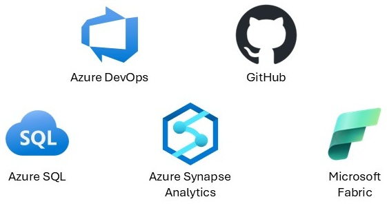

# kevchant's GitHub Pages

Hi all, and welcome to my GitHub Pages! Which allows you to easily navigate to find certain repositories that I have available relating to various Microsoft Data Platform offerings.

    

You can click on any of the below links to find the relevant repositories I share for that particular area. 

For example, clicking on the "Using Azure DevOps for Azure SQL Database deployments" link will take you to all the repositories I share relating to using Azure DevOps for Azure SQL Database deployments.

My only ask is that if any of the repositories prove to be useful for you please give them a star in GitHub.

[Using Azure DevOps for Azure SQL Database deployments](azdoazuresqldb.md).

[Using GitHub for Azure SQL database deployments](ghazuresqldb.md).

[Using Azure DevOps for Azure Synapse deployments](azdoazuresynapse.md).

[Using GitHub for Azure Synapse deployments](ghazuresynapse.md).

[Using Azure DevOps for Microsoft Fabric deployments](azdomicrosoftfabric.md).

[Using GitHub for Microsoft Fabric deployments](ghmicrosoftfabric.md).

[Using Azure DevOps for SQL Server deployments](azdosqlserver.md).

[Using GitHub for SQL Server deployments](ghsqlserver.md).

[Past presentations](presentations.md).

[All repositories I have forked](forks.md).

<!-- counterAPI library -->

<!-- Add the counter instance-->

